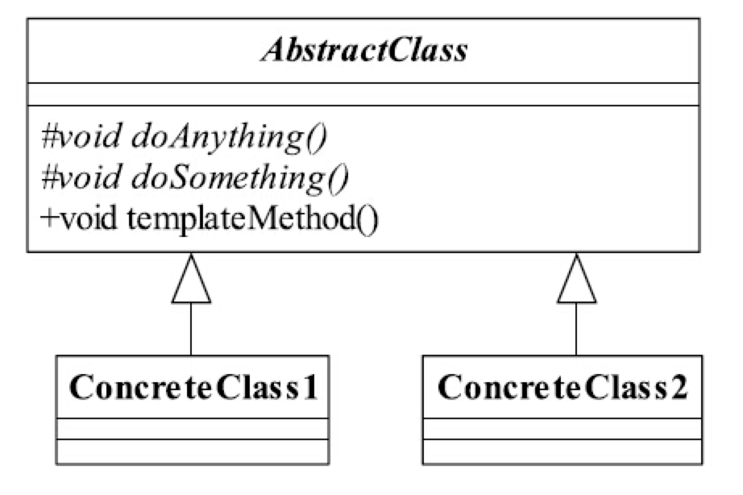

#模板方法模式（Template Method Pattern）
##1.定义
Define the skeleton of an algorithm in an operation, deferring some steps to subclasses. Template method Lets subclasses redefine certain steps of an algorithm without changing the algorithm structrue.

在某个操作中定义一个逻辑的框架，将一些步骤延迟到子类里。使得子类在改变算法结构的情况下可以重新定义该算法的某些步骤。

AbstractClass叫抽象模板，它的方法分为两类：

- 基本方法

也叫基本操作，由子类实现的方法，并且在模板方法中被调用。

> 基本方法尽量设计为protected类型（迪米特法则）

- 模板方法

可以有一个或者几个，一般是一个具体的方法，也就是一个框架，实现对基本方法的调度，完成固定的逻辑。

> 一般被final修饰，防止恶意篡改。

##2.优缺点
###（1）优点

- 封装不变部分，扩展可变部分
- 提取公共部分代码，便于维护
- 行为由父类控制，子类实现

##3.使用场景

- 多个子类有公有的方法，并且逻辑基本相同
- 重要、复杂的算法，可以把核心算法设计为模板方法，周边的相关细节功能则由各个子类实现。
- 重构时，把相同的代码抽取到父类中，然后通过钩子函数约束其行为。

